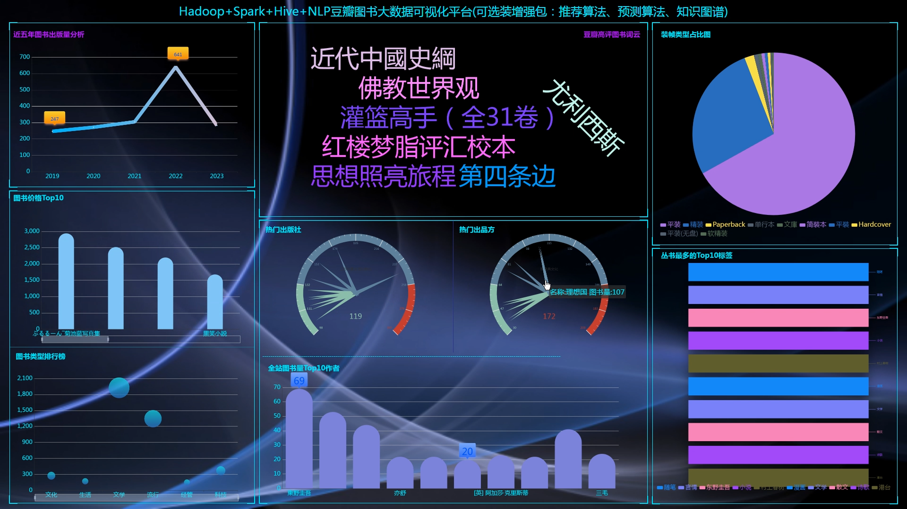
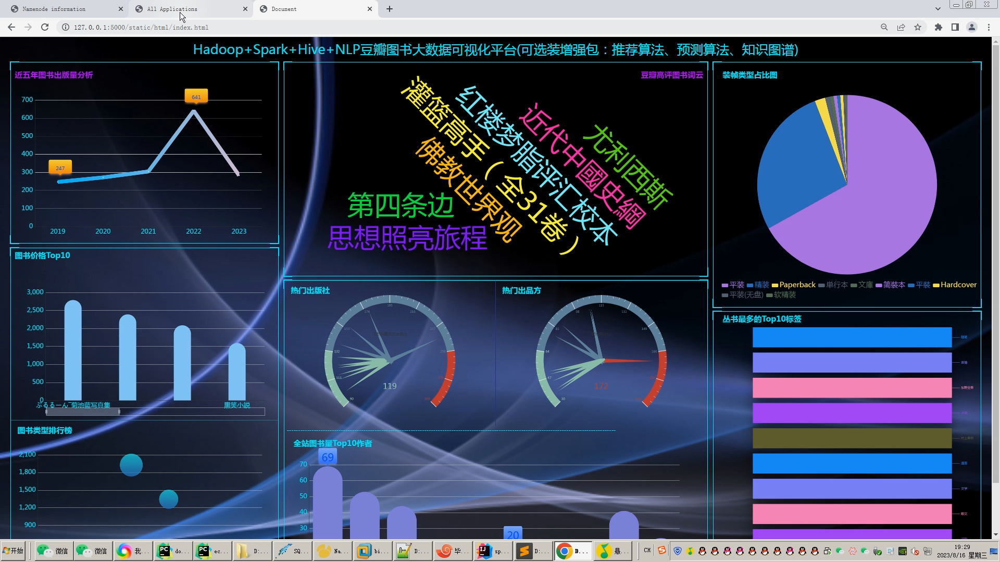
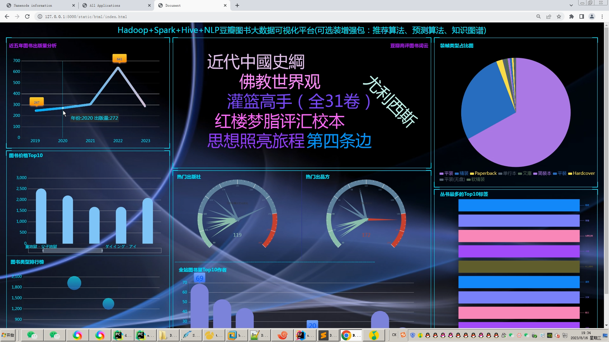
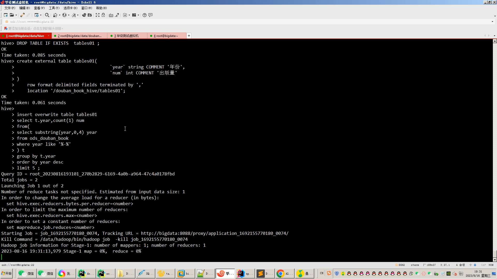
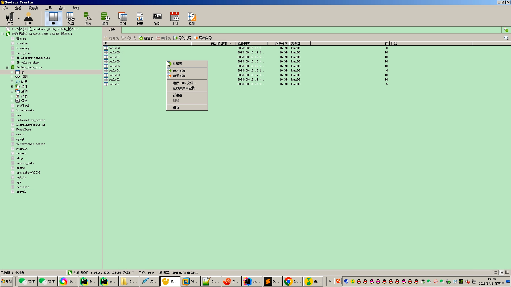
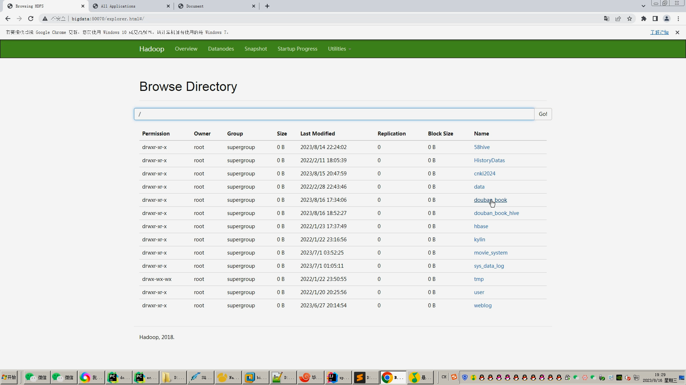
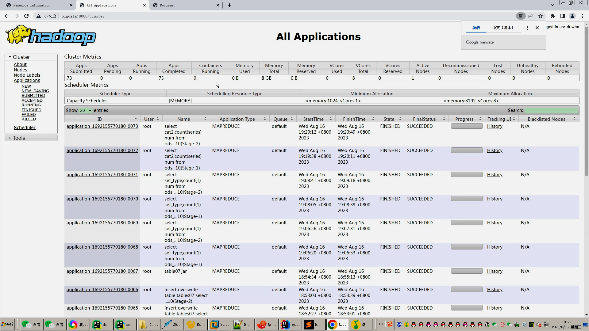
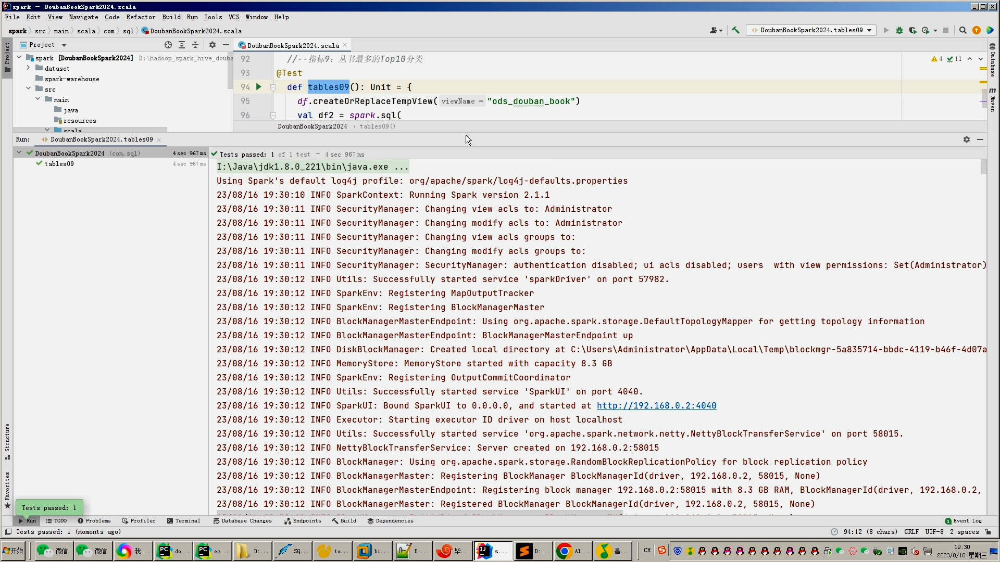
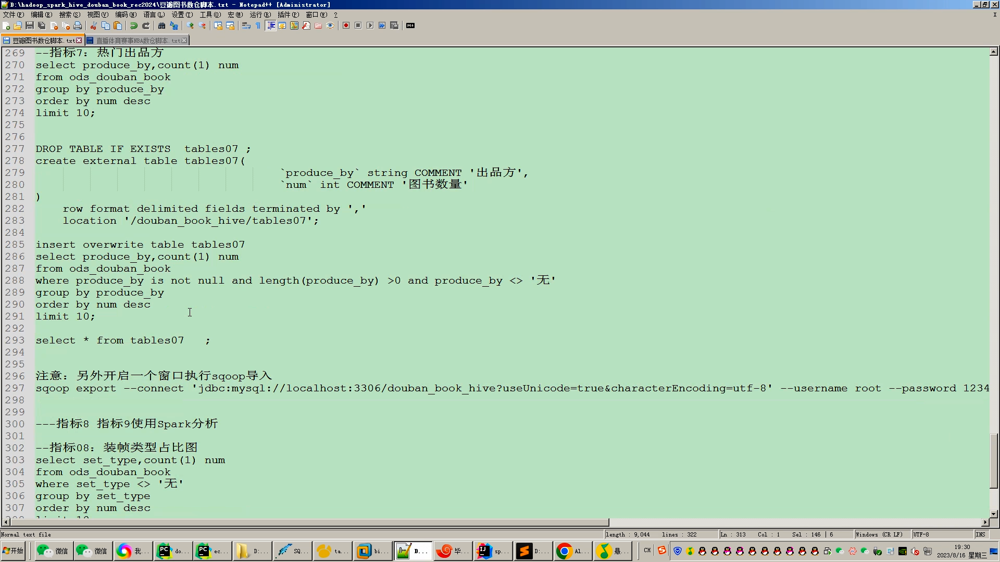
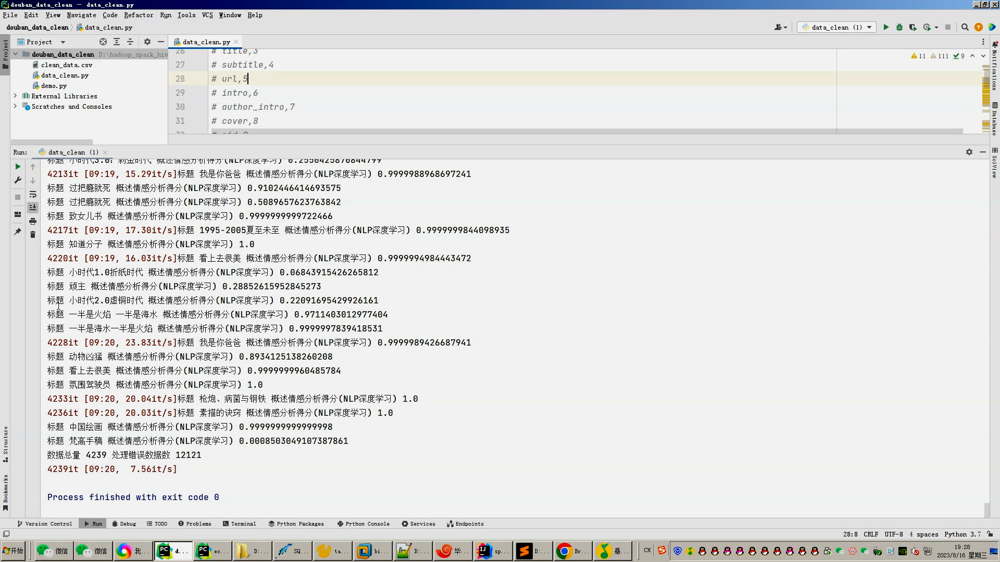

## 计算机毕业设计吊打导师hadoop+spark+hive豆瓣图书数据分析可视化大屏 豆瓣图书爬虫 图书推荐系统 知识图谱 图书大数据 大数据毕业设计 机器学习 预测系统 数据仓库 大数据毕业设计 文本分类 LSTM情感分析 大数据毕业设计 知识图谱 大数据毕业设计 预测系统 实时计算 离线计算 数据仓库 人工智能 神经网络

## 要求
### 源码有偿！一套(论文 PPT 源码+sql脚本+教程)

### 
### 加好友前帮忙start一下，并备注github有偿hive豆瓣图书
### 我的QQ号是2827724252或者798059319或者 1679232425或者微信:bysj2023nb

# 

### 加qq好友说明（被部分 网友整得心力交瘁）：
    1.加好友务必按照格式备注
    2.避免浪费各自的时间！
    3.当“客服”不容易，repo 主是体面人，不爆粗，性格好，文明人。

基础版，也就是当前下面连接这个版本(只带hadoop spark hive flask scrapy爬虫 echarts大屏可视化驾驶舱)

https://www.bilibili.com/video/BV1X8411X7YY/?spm_id_from=333.999.0.0

## 开发技术：
spark hadoop hive 装杯显摆虚拟机Linux敲命令炫酷吊打 flask echarts sqoop scala hdfs yarn mysql requests爬虫框架等；

## 流程： 

1.scrapy采集豆瓣图书数据存入sqlite便携式内嵌数据库,从sqlite导出csv文件，使用pandas+numpy/MapReduce数据清洗再次生成清洁的.csv文件；
2.使用hive数仓工具进行建库建表操作并导入.csv文件数据；
3.离线分析采用hive_sql完成，实时计算采用Spark+Scala完成；
4.离线+实时计算的结果指标使用sqoop导入mysql数据库；
5.使用Flask+Echarts搭建可视化大屏展示；

## 创新点：
Python爬虫、可视化大屏、离线数仓hive+实时计算Spark双结合双实现防止导师喷人、使用vmvare虚拟机模拟大数据环境、NLP文本分类等

如果他(导师)还是狂喷不止，继续选择以下的系统，他们可以选装牛鼻功能！

## 可选装项目模块如下：
1.推荐系统(4种深度学习推荐算法 协同过滤基于用户 基于物品 SVD神经网络 MLP)。附带AI、支付、短信、lstm情感分析。
2.预测系统(KNN CNN RNN卷积神经预测 K-means 线性回归)。
3.知识图谱neo4j可视化关系网络图。
4.后台管理系统。

选装视频效果如下：
https://www.bilibili.com/video/BV19h4y1Q7EJ/?spm_id_from=333.999.0.0

